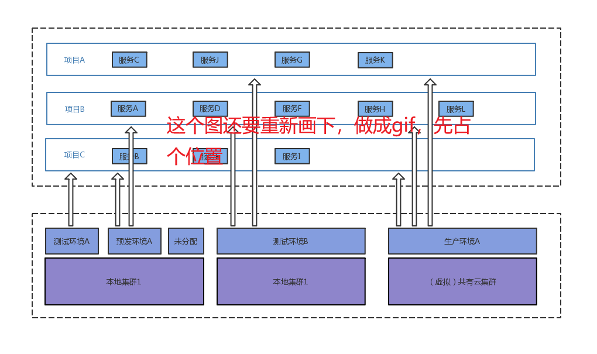

[English](./index_en.md) | [官网](https://atayun.net)  | [社区](xxxxx) · [论坛](xxxxx) | [设计文档](./design.md) | [使用文档](./user_guide.md) | [安装文档](install.md) | [版本更新](./releases.md)

开源社区欢迎您的参与！如果有任何反馈，您[可以通过这些方式联系我们](xxxxx)  

<h1>阿塔云 Bazooka - 自动化开发运维平台</h1>

Bazooka自动化开发运维平台，在[Docker](https://www.docker.com/)，[Mesos](http://mesos.apache.org/)，[Kubernetes](https://kubernetes.io/)，[Jenkins](https://jenkins.io)，[Gitlab](https://about.gitlab.com/)等开源技术的基础上，以应用和计算资源为中心，实现本地和云端的各类计算资源的一致性，帮助企业应对敏捷开发、自动化构建部署、微服务治理、多租户管理、容器和镜像仓库管理、容器监控和日志等业务场景。

# 核心功能

- [**资源**](./function_source.md) - 通过Mesos集群、Kubernetes集群或者独立节点的方式，管理物理机、虚拟机、云主机等各类计算资源
- [**环境**](./function_environment.md) - 用户根据开发场景划分，例如“测试环境”、“预发布环境”、“生产环境”等。环境通过资源切分，为各个项目中的服务提供透明、无感知的计算资源调度
- [**项目**](./function_project.md) - 按照业务划分的逻辑分组，由一组关联的服务、用户组成，通过项目关联的环境向各个服务提供标准的计算资源
- [**服务**](./function_service.md) - 一个服务对应一个完整的生命周期，拥有代码管理、编译、打包、容器镜像、测试、发布、部署、运维、监控等完整的功能
- [**服务发布流水线**](./function_deploy.md) - 通过发布调度引擎和各类标准插件提供可编辑的服务流水线，自动调度以完成服务的资源检查、审批、代码拉取、质量扫描、代码编译、镜像构建、容器部署、健康检查、通知等完整流程
- [**系统信息**](./function_system.md) - 系统基础信息、组件状态和凭据管理
- [**用户管理**](./function_user.md) - 系统用户管理，角色分配

您也可以通过[系统截图](./user_guide.md)对Bazooka有一个更加直观的认识和理解，也可以访问[阿塔云官网](https://atayun.net)，获得更详细的信息。

# 安装和部署

可以访问[安装文档](./install_local_cluster.md)，获得详细的安装说明。

# 开始使用Bazooka

开始使用Bazooka之前，请阅读[使用文档](./user_guide.md)

# 使用Bazooka进行开发

Bazooka前后端分离，请分别查看[后端开发文档](./development_backend.md)和[前端开发文档](./development_frontend.md)

Bazooka的核心是发布调度引擎，包括了各个独立开发的插件，如果您对插件开发有兴趣，请查看[发布调度引擎和插件文档](./development_schedule_engine.md)

# 开源地址

[https://github.com/ata-cloud/ata-cloud-service](https://github.com/ata-cloud/ata-cloud-service)

# 版权说明

自身使用 Apache v2.0 协议，Bazooka uses Apache 2.0.

# 阿塔云相关开源产品链接

[sword - 公共组件包，致力于减少重复开发工作量](https://github.com/ata-cloud/sword)

# BUG与建议反馈

若您安装使用时有任何建议问题、反馈或发现的 Bug，欢迎在 [GitHub Issue](xxxxx) 提交 Issue。

邮件交流：tangkui@yofish.com

QQ交流：

