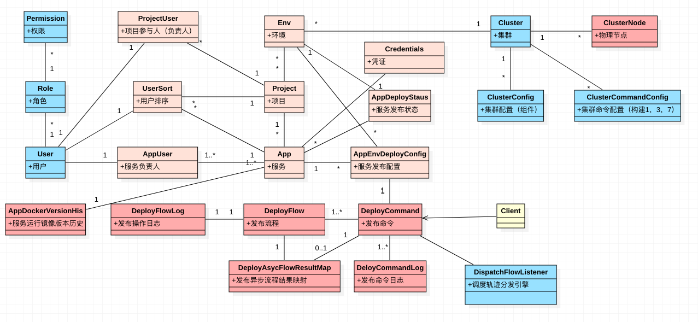
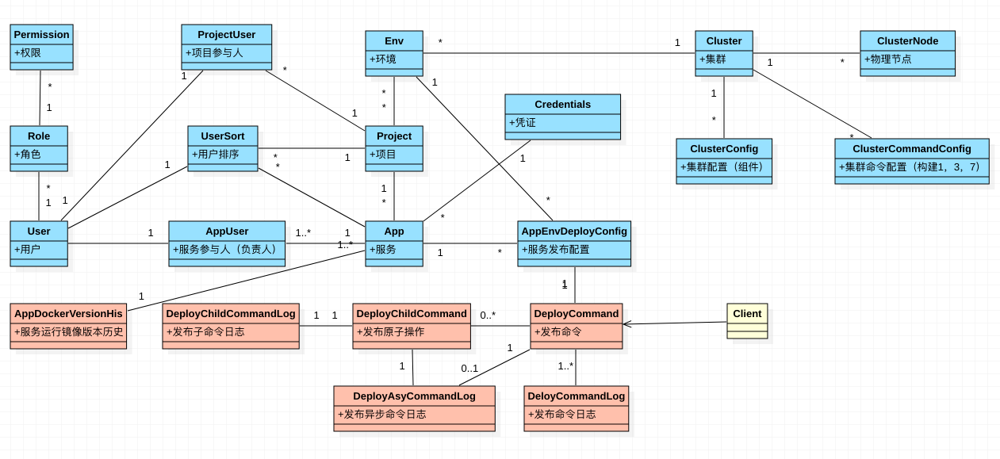

Bazooka 从本质上解决的问题如下： 
1（权限管理）：谁，在企业中是什么角色，有哪些功能权限  
2（项目管理）：他能管理哪些服务，这些服务属于哪些项目（产品线）， 项目能布到哪些环境（测试，预发，生产）， 这些环境在哪个集群（上海线上机房K8s集群， 苏州线上机房） 
<<<<<<< Updated upstream
3（发布系统）：从外部接收指令，解决 能否执行，如何执行的问题，执行的成功失败 如何处理 
4（需求管理）：这个服务为什么存在， 为什么要进行这次发布， 这次发布解决了哪些问题 
5（工单系统）：解决一个流程 的多个节点 的权限 审批问题 
6（应用市场）：功能共享和复用，快速发布中间件  
7（插件管理）：功能扩展 

---------------

# 领域模型设计
#### [领域模型图](./GetStarted.md)

#### [流程图](./GetStarted.md)

#### [发布状态机](./GetStarted.md)

# 功能模块
=======
3（发布系统）：从外部接收指令，解决 能否执行，如何执行的问题，执行的成功失败 如何处理  
4（需求管理）：这个服务为什么存在， 为什么要进行这次发布， 这次发布解决了哪些问题  
5（工单系统）：解决一个流程 的多个节点 的权限 审批问题  
6（应用市场）： 
7（插件管理）：

---------------

# 领域模型
>>>>>>> Stashed changes
#### [系统信息](./GetStarted.md)
> 系统基础信息、组件状态和凭据管理

#### [用户管理](./GetStarted.md)
> 系统用户管理，角色分配

#### [集群管理](./GetStarted.md)
> 安装在物理机、虚拟机、云主机等设备上的DC/OS容器集群，管理所有可用的计算资源，使用环境分隔之后可以用于服务的部署

#### [环境管理](./GetStarted.md)
> 环境用于按功能分隔集群的计算资源，比如分为“测试环境”、“预发布环境”、“生产环境”等，各个服务将部署在所属项目已关联的环境中

#### [项目管理](./GetStarted.md)
> 一个项目管理一系列的服务，关联一个项目负责人和多个参与人，同时关联多个环境用于服务的部署

#### [服务管理](./app_manage.md)
> 一个服务对应一个完整的生命周期，拥有代码管理、编译、打包、容器镜像、测试、发布、部署、运维、监控等完整的功能

<<<<<<< Updated upstream
=======
# E-R Diagram
#### [分配环境](./GetStarted.md)
#### [新建项目](./GetStarted.md)
#### [新建服务](./app_create.md)
#### [新建服务发布配置](./app_deploy_config_create.md)
#### [服务发布](./app_deploy.md)
#### [服务镜像管理](./app_docker_image_management.md)

# 安装

#### [本地集群安装](./install_local_cluster.md)
#### [本地单机安装](./GetStarted.md)

# 运维手册
##### Docker 镜像库
> 自动清理镜像，每个应用每个环境默认保留最近10个tag。每天凌晨3点，系统自动运行清理任务。

# 进阶场景
> 推送镜像到指定的镜像库
>>>>>>> Stashed changes

# 常见问题

# 更新记录

------------